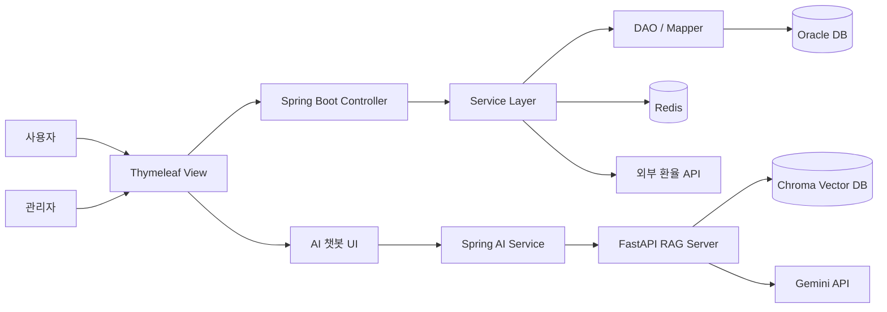
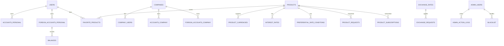
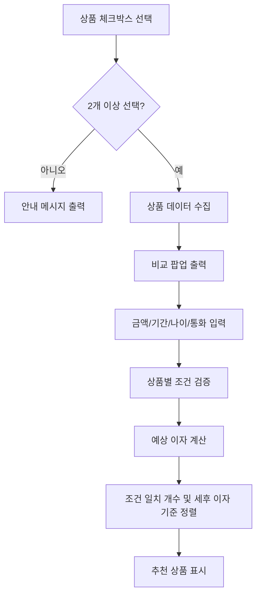
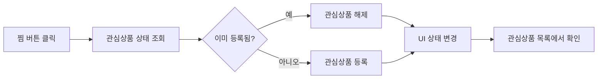
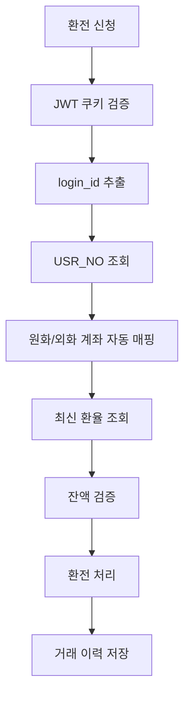
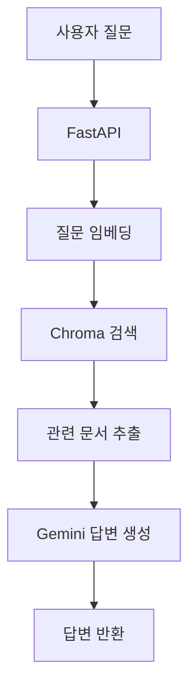

# BNK 외환 상품 관리 및 고객 상품 안내 서비스

> BNK 부산은행 외환 서비스를 모티브로 제작한 은행 상품 관리 및 고객 상품 안내 웹 서비스입니다.  
> 사용자에게는 외환 상품 조회, 상품 비교, 관심상품, 환율 조회, 환전 기능, AI 챗봇을 제공하고, 관리자에게는 상품 등록, 결재, 회원/계좌/로그/블랙리스트 관리 기능을 제공합니다.

<br>

## 목차

1. [프로젝트 소개](#프로젝트-소개)
2. [팀 구성 및 담당 기능](#팀-구성-및-담당-기능)
3. [주요 기능](#주요-기능)
4. [기술 스택](#기술-스택)
5. [시스템 아키텍처](#시스템-아키텍처)
6. [ERD 요약](#erd-요약)
7. [프로젝트 구조](#프로젝트-구조)
8. [실행 방법](#실행-방법)
9. [보안 및 안정성](#보안-및-안정성)
10. [개선 사항](#개선-사항)


<br>

## 프로젝트 소개

최근 디지털 금융 서비스 이용이 증가하면서 사용자는 은행 업무를 쉽고 편리하게 이용할 수 있는 환경을 요구하고 있습니다.  
하지만 외환 서비스는 금융 용어와 상품 종류가 다양하여 사용자가 필요한 정보를 빠르게 찾기 어렵다는 문제가 있습니다.

본 프로젝트는 사용자 페이지, 관리자 페이지, AI 챗봇, 보안 시스템을 포함한 외환 상품 안내 및 관리 서비스를 구현하는 것을 목표로 했습니다.

### 개발 기간

| 구분 | 기간 |
|---|---|
| 기획 | 5/1 ~ 5/12 |
| 설계 | 5/7 ~ 5/12 |
| 구현 | 5/13 ~ 5/27 |
| 발표 및 마무리 | 5/28 |
| 총 개발 기간 | 약 4주 |

<br>

## 팀 구성 및 담당 기능

| 이름 | 담당 영역 | 주요 구현 내용 |
|---|---|---|
| 김건엽 | 개인/기업 회원, JWT 인증 | 개인/기업 회원가입, 로그인, 마이페이지, JWT 쿠키 인증, 계좌 조회 |
| 김다현 | 관리자 상품 관리 | 관리자 로그인, 상품 등록/수정/조회, 결재 요청, 약관 PDF 등록, 관리자 권한별 접근 제한 |
| 신정훈 | 환율/환전 시스템 | 환율 조회, 환전 계산기, 개인 환전 신청, 환전 이력, 환율 스케줄러, 외부 환율 API 연동 |
| 이민주 | 사용자 상품 관리 | 상품 목록/상세, 상품 비교, 외화 예상 이자 계산, 추천 상품, 관심상품, 큰 화면 기능 |
| 이유림 | AI 챗봇/보안 | RAG 기반 AI 챗봇, FastAPI, Chroma, Gemini 연동, HTTPS, Redis 블랙리스트, 요청 제한 |

<br>

## 주요 기능

### 사용자 기능

| 구분 | 기능 | 설명 |
|---|---|---|
| 상품 조회 | 개인/기업/외화 상품 목록 | 사용자 유형별 상품 목록 조회 및 필터링 |
| 상품 상세 | 상품 상세 정보 확인 | 금리, 가입 기간, 가입 금액, 이자 지급 방식, 약관 PDF 확인 |
| 상품 비교 | 선택 상품 비교 | 2개 이상의 상품을 선택해 조건과 예상 이자 비교 |
| 외화 상품 계산 | 외화 예상 이자 계산 | 원화 예치금액을 외화로 환산하고 세후 이자 및 만기 예상 금액 계산 |
| 추천 상품 | 조건 기반 추천 | 금액, 기간, 나이, 통화 조건에 가장 적합한 상품 추천 |
| 관심상품 | 찜 등록/해제 | 관심 있는 상품을 저장하고 관심상품 페이지에서 재확인 |
| 큰 화면 | 화면 확대 | 접근성을 고려한 큰 글씨/큰 화면 기능 |
| 환율 조회 | 환율 차트/통화별 조회 | 외부 환율 API 기반 환율 조회 및 차트 출력 |
| 환전 계산 | 예상 환전 금액 계산 | 매매기준율, 우대율, 적용환율 기반 환전 예상 금액 계산 |
| 환전 신청 | 원화 ↔ 외화 환전 | JWT 기반 본인 계좌 자동 매핑 후 환전 처리 |
| AI 챗봇 | 외환 정보 안내 | 외환 FAQ, 상품 정보, 서비스 설명 문서 기반 답변 |

### 관리자 기능

| 구분 | 기능 | 설명 |
|---|---|---|
| 관리자 인증 | 로그인/권한 분기 | CHIEF, HEAD, EXECUTIVE 등 역할별 접근 제한 |
| 상품 등록 | 외화 상품 등록 | 상품명, 타입, 대상, 기간, 금액, 통화, 금리, 약관 PDF 등록 |
| 상품 관리 | 상품 조회/검색/수정/삭제 | 결재 상태, 상품 타입, 대상 고객 기준 관리 |
| 결재 관리 | 상품 승인/반려 | 등록 상품에 대한 결재 요청 및 처리 |
| 회원 관리 | 개인/기업 회원 관리 | 사용자 정보 조회 및 수정 |
| 계좌 관리 | 개인/기업 계좌 관리 | 원화/외화 계좌 조회 |
| 공지/이벤트 | 공지사항 및 이벤트 관리 | 관리자 공지, 이벤트 등록 및 조회 |
| 로그 관리 | API/관리자 작업 로그 | 요청 기록 및 관리자 작업 이력 관리 |
| 블랙리스트 | 사용자 차단 관리 | Redis 기반 요청 제한 및 차단 사용자 관리 |

<br>

## 기술 스택

| 영역 | 기술 |
|---|---|
| Backend | Spring Boot 3.4.5, Java 21 |
| Frontend | HTML5, CSS3, JavaScript, Thymeleaf |
| Database | Oracle Database, Redis, Chroma |
| Persistence | MyBatis, MyBatis XML Mapper |
| AI | FastAPI, LangChain, Google Gemini 2.5 Flash, Gemini Embedding-001 |
| Authentication | JWT, HttpOnly Cookie |
| Security | HTTPS/SSL, BCrypt, Bucket4j, Redis Blacklist |
| Build Tool | Gradle |
| 개발 환경 | Eclipse IDE, Visual Studio Code |
| 협업 도구 | GitHub, Notion |

<br>

## 시스템 아키텍처



<br>

## ERD 요약



### 주요 테이블

| 테이블 | 설명 |
|---|---|
| users | 개인 회원 정보 |
| companies | 기업 정보 |
| company_users | 기업 회원 사용자 정보 |
| admin_users | 관리자 정보 및 권한 |
| accounts_personal | 개인 원화 계좌 |
| accounts_company | 기업 원화 계좌 |
| foreign_accounts_personal | 개인 외화 계좌 |
| foreign_accounts_company | 기업 외화 계좌 |
| balances | 외화 잔액 이력 |
| exchange_rates | 고시 환율 정보 |
| exchange_requests | 환전 거래 이력 |
| products | 상품 기본 정보 |
| product_currencies | 상품별 지원 통화 |
| interest_rates | 상품별 금리 정보 |
| preferential_rate_conditions | 우대 금리 조건 |
| favorite_products | 관심상품 |
| product_subscriptions | 상품 가입 정보 |
| product_requests | 상품 결재 요청 |
| blacklist | 차단 사용자 정보 |
| api_logs | API 요청 로그 |
| admin_action_logs | 관리자 작업 로그 |
| news | 공지사항 |
| events | 이벤트 |

<br>

## 핵심 기능 상세

### 1. 상품 비교 및 추천

사용자가 여러 상품을 선택하면 상품의 가입 조건, 금리, 기간, 금액, 예상 이자를 한 화면에서 비교할 수 있습니다.



#### 외화 상품 계산식

```text
외화 원금 = 원화 예치금액 ÷ 적용 환율
외화 세전 이자 = 외화 원금 × (금리 / 100) × (가입기간 / 12)
외화 세후 이자 = 외화 세전 이자 × 0.846
예상 원화 환산금액 = 만기 예상 외화금액 × 적용 환율
```

> 0.846은 이자소득세 15.4% 공제 후 비율입니다.

### 2. 관심상품

상품 카드와 상세 페이지에서 찜 버튼을 제공하고, 사용자는 관심상품을 등록하거나 해제할 수 있습니다.



### 3. 환전 시스템

JWT 토큰에서 로그인 사용자를 식별하고, 서버에서 본인 계좌를 자동 매핑하여 환전 거래를 처리합니다.



### 4. RAG 기반 AI 챗봇

외환 FAQ, 상품 정보, 외환 서비스 설명 문서를 Chroma DB에 저장하고, 사용자 질문과 관련된 문서를 검색한 뒤 Gemini 모델로 답변을 생성합니다.



| 개선 항목 | 적용 내용 |
|---|---|
| 할루시네이션 방지 | 관련 문서가 없으면 임의 답변을 생성하지 않도록 프롬프트 제한 |
| 청크 전략 | 청크 크기를 줄이고 오버랩을 적용하여 검색 정확도 개선 |
| MMR 검색 | 다양한 문서를 검색해 답변 근거 강화 |
| temperature 0 | 문서 기반 답변 유지 |
| 디버깅 로그 | 검색된 문서를 콘솔에서 확인하며 검증 |

<br>

## 프로젝트 구조

```text
banking_system
├── build.gradle
├── settings.gradle
├── gradlew
├── gradlew.bat
├── app.py                         # FastAPI 기반 RAG 챗봇 서버
├── init_db.py                     # Chroma DB 초기화/적재 스크립트
├── chroma_docs_db                 # Chroma Vector DB 저장소
├── src
│   ├── main
│   │   ├── java/com/example/demo
│   │   │   ├── BankingSystemApplication.java
│   │   │   ├── MainController.java
│   │   │   ├── admin              # 관리자 기능
│   │   │   │   ├── controller
│   │   │   │   ├── dao
│   │   │   │   ├── dto
│   │   │   │   └── service
│   │   │   ├── commonLogin        # 개인/기업 공통 로그인
│   │   │   ├── company            # 기업 회원/기업 마이페이지
│   │   │   ├── config             # Redis, Bucket4j, Filter, 파일 설정
│   │   │   ├── exchange           # 환율 조회 관련 공통 기능
│   │   │   ├── foreign            # 외환 안내 페이지 라우팅
│   │   │   ├── fx_personal        # 개인 환율/환전/스케줄러
│   │   │   ├── interceptor        # API 로그, 관리자 로그, 요청 제한 필터
│   │   │   ├── jwt                # JWT 생성/검증/인증 필터
│   │   │   ├── personal           # 개인 회원가입/마이페이지/계좌
│   │   │   ├── product            # 상품 목록/상세/비교/관심상품/PDF
│   │   │   ├── randomNumber       # 계좌번호 생성 유틸
│   │   │   └── search             # 검색 기능
│   │   │
│   │   └── resources
│   │       ├── application.properties
│   │       ├── mapper/mybatis
│   │       │   ├── adminDao.xml
│   │       │   ├── adminProductDao.xml
│   │       │   ├── blacklist.xml
│   │       │   ├── companyDAO.xml
│   │       │   ├── exchangeDao.xml
│   │       │   ├── fxData.xml
│   │       │   ├── login.xml
│   │       │   ├── myPageDAO.xml
│   │       │   ├── productDao.xml
│   │       │   ├── productFavoriteDao.xml
│   │       │   ├── productPdfDao.xml
│   │       │   └── search.xml
│   │       │
│   │       ├── static
│   │       │   ├── css
│   │       │   │   ├── admin
│   │       │   │   ├── company
│   │       │   │   ├── foreign
│   │       │   │   ├── fx
│   │       │   │   ├── personal
│   │       │   │   ├── product
│   │       │   │   └── search
│   │       │   ├── js
│   │       │   │   ├── fx
│   │       │   │   ├── product
│   │       │   │   ├── search
│   │       │   │   └── sideBar
│   │       │   ├── images
│   │       │   └── pdf
│   │       │       ├── common
│   │       │       ├── foreign
│   │       │       └── products
│   │       │
│   │       └── templates
│   │           ├── admin          # 관리자 화면
│   │           ├── common         # 챗봇 등 공통 화면
│   │           ├── company        # 기업 화면
│   │           ├── foreign        # 외환 안내 화면
│   │           ├── fragments      # 공통 조각 화면
│   │           ├── fx             # 환율/환전 화면
│   │           ├── personal       # 개인 회원/마이페이지
│   │           └── product        # 상품 목록/상세/관심상품
│   │
│   └── test
└── README.md
```

### 주요 패키지 설명

| 패키지 | 설명 |
|---|---|
| `admin` | 관리자 로그인, 대시보드, 상품 등록/수정/조회, 결재, 회원/계좌/공지/이벤트/로그/블랙리스트 관리 |
| `commonLogin` | 개인/기업 공통 로그인 처리 |
| `personal` | 개인 회원가입, 개인 마이페이지, 개인 원화/외화 계좌 조회 |
| `company` | 기업 회원가입, 기업 메인, 기업 마이페이지 |
| `product` | 사용자 상품 목록, 상품 상세, 상품 비교, 관심상품, 약관 PDF 관련 기능 |
| `foreign` | 외환 서비스 안내 페이지 라우팅 |
| `fx_personal` | 개인 환율 조회, 환전 계산, 환전 신청, 환전 이력, 환율 스케줄러 |
| `exchange` | 환율 데이터 조회 및 응답 처리 |
| `jwt` | JWT 생성, 검증, 인증 필터 |
| `interceptor` | API 로그, 관리자 로그, 사용자 식별, 요청 제한 필터 |
| `config` | Redis, Bucket4j, 파일 업로드, 필터 설정 |
| `search` | 검색 페이지 및 검색 기능 |

### 화면 템플릿 구성

| 경로 | 설명 |
|---|---|
| `templates/admin` | 관리자 로그인, 대시보드, 상품 관리, 결재, 회원/계좌/로그/공지/이벤트/블랙리스트 화면 |
| `templates/product` | 개인/기업/외화 상품 목록, 상품 상세, 관심상품 화면 |
| `templates/foreign` | 외화예금, 환전, 송금, 수출입금융, 외환 가이드 등 외환 안내 화면 |
| `templates/fx` | 환율 조회, 환전 메인, 환전 신청 화면 |
| `templates/personal` | 개인 회원가입, 마이페이지, 정보 수정, 비밀번호 변경 화면 |
| `templates/company` | 기업 메인, 기업 회원가입, 기업 마이페이지 화면 |
| `templates/common` | 챗봇 페이지 등 공통 화면 |
| `templates/fragments` | 외환 사이드바 등 공통 조각 화면 |

<br>

## 실행 방법

### 1. Spring Boot 실행

```bash
git clone https://github.com/사용자명/레포지토리명.git
cd banking_system
./gradlew bootRun
```

Windows 환경에서는 아래 명령어를 사용할 수 있습니다.

```bash
gradlew.bat bootRun
```

HTTPS 설정 기준 접속 주소는 다음과 같습니다.

```text
https://localhost:8443
```

### 2. 환경 설정

`src/main/resources/application.properties`에서 아래 값을 본인 환경에 맞게 수정해야 합니다.

```properties
# Server / HTTPS
server.port=8443
server.ssl.enabled=true
server.ssl.key-store-type=PKCS12
server.ssl.key-store=classpath:keystore.p12
server.ssl.key-store-password=키스토어_비밀번호
server.ssl.key-alias=tomcat

# Oracle DB
spring.datasource.driver-class-name=oracle.jdbc.driver.OracleDriver
spring.datasource.url=jdbc:oracle:thin:@//호스트:포트/서비스명
spring.datasource.username=DB계정
spring.datasource.password=DB비밀번호

# MyBatis
mybatis.mapper-locations=classpath:mapper/mybatis/**/*.xml

# JWT
jwt.secret=JWT_SECRET_KEY
jwt.expiration=900000

# Redis Cache
spring.cache.type=redis

# File Upload
file.upload-dir=업로드_경로
file.max-size=10MB
file.allowed-type=pdf
```

### 3. AI 챗봇 서버 실행

AI 챗봇은 Spring Boot와 별도로 FastAPI 서버를 실행합니다.

```bash
pip install fastapi uvicorn python-dotenv langchain-google-genai langchain-chroma langchain-core
uvicorn app:app --host 0.0.0.0 --port 8000
```

`.env` 파일에는 Gemini API Key를 설정합니다.

```env
GOOGLE_API_KEY=발급받은_API_KEY
```

<br>

## 보안 및 안정성

| 항목 | 내용 |
|---|---|
| JWT 인증 | 로그인 성공 시 JWT를 쿠키로 발급하고 요청마다 검증 |
| BCrypt | 사용자/관리자 비밀번호 단방향 해시 암호화 |
| HTTPS | OpenSSL 기반 자체 서명 인증서를 이용한 HTTPS 통신 적용 |
| Redis Blacklist | IP + UUID 쿠키 기반 클라이언트 식별 후 차단 처리 |
| Bucket4j | 짧은 시간 내 반복 요청 제한 |
| API Logging | 요청 URL, Method, 응답 코드, 처리 시간, IP 기록 |
| Admin Log AOP | 관리자 작업 이력 기록 |
| Transaction | 환전 처리 시 `@Transactional`로 잔액 변경과 이력 저장 정합성 보장 |
| 서버 측 환율 검증 | 환전 요청 시 서버에서 최신 환율을 다시 조회하여 프론트 변조 방지 |
| INSERT-only 잔액 이력 | 외화 잔액을 업데이트 대신 누적 저장하여 감사 추적 가능 |

<br>

## 개선 사항

| 개선 항목 | 내용 |
|---|---|
| 환율 변동 시뮬레이션 | 환율 변동에 따른 만기 예상 수령액 변화 제공 |
| Refresh Token | 활동 중 자동 토큰 연장을 통해 로그인 만료 불편 개선 |
| 챗봇 링크 연결 | 챗봇 답변에 관련 기능/페이지 이동 링크 제공 |
| 관리자 워크플로우 | 금리 담당, 약관 담당 등 역할별 승인 프로세스 세분화 |
| 개인화 추천 | 사용자 조건과 이용 이력을 반영한 상품 추천 고도화 |
| 배포 환경 보완 | 자체 서명 인증서 대신 CA 인증서 적용 및 운영 설정 분리 |

<br>


## 회고

이번 프로젝트를 통해 금융 상품 안내 서비스는 단순한 상품 조회 기능뿐만 아니라 사용자 편의성, 상품 비교 로직, 환율 계산, 보안, 관리자 운영 프로세스까지 함께 고려해야 한다는 점을 배웠습니다.

특히 상품 비교 기능은 상품 선택, 개수 검증, 조건 확인, 외화 예상 이자 계산, 추천 상품 표시까지 단계별 로직 설계가 필요했고, 환전 기능은 JWT 인증, 서버 측 환율 검증, 트랜잭션 처리, 잔액 이력 보존 등 안정성이 중요하다는 점을 확인할 수 있었습니다.

추후에는 환율 변동 시뮬레이션, Refresh Token, 챗봇 페이지 연결, 관리자 역할별 워크플로우를 보완하여 더 실제 서비스에 가까운 형태로 개선하고자 합니다.
