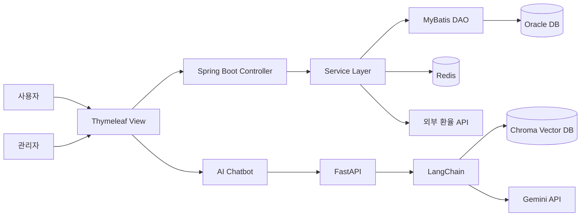
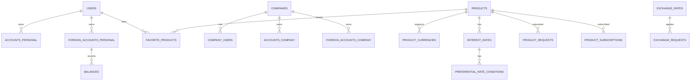
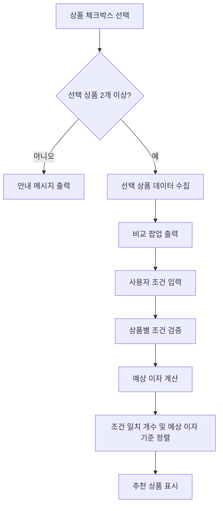
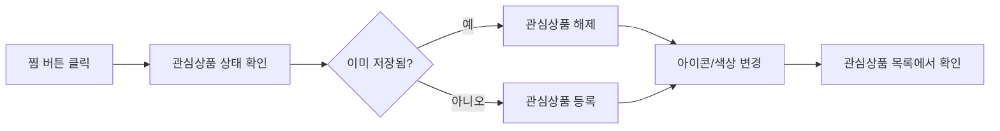
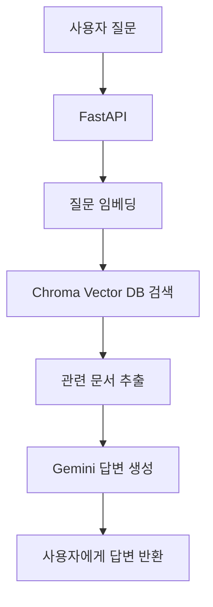

# BNK 외환 상품 관리 및 고객 상품 안내 서비스

> OpenAI를 활용한 은행 상품 판매를 위한 상품 관리 페이지 및 고객 상품 안내 페이지 개발 프로젝트입니다.  
> 사용자에게 외환 상품 조회, 상품 비교, 관심상품 저장, 환전/환율 정보, AI 챗봇 안내 기능을 제공하고, 관리자에게는 상품 등록, 상품 관리, 결재 처리 기능을 제공하는 웹 서비스입니다.

<br>

## 1. 프로젝트 개요

최근 디지털 금융 서비스 이용이 증가하면서 사용자는 은행 업무를 더 쉽고 편리하게 이용할 수 있는 환경을 요구하고 있습니다.  
특히 외환 서비스는 금융 용어와 상품 종류가 다양해 사용자가 필요한 정보를 찾기 어렵다는 문제가 있습니다.

본 프로젝트는 BNK 부산은행 외환 서비스를 모티브로 하여, 사용자가 외환 상품과 금융 정보를 한 곳에서 조회하고 비교할 수 있도록 기획한 웹 서비스입니다.

<br>

## 2. 주요 기능

### 사용자 기능

| 구분 | 기능 | 설명 |
|---|---|---|
| 상품 조회 | 개인/기업 상품 목록 조회 | 예금, 적금, 외화예금 등 상품을 사용자 유형별로 조회 |
| 상품 상세 | 상품 상세 정보 확인 | 금리, 가입 기간, 가입 금액, 이자 지급 방식, 약관 정보 제공 |
| 상품 비교 | 선택 상품 비교 | 2개 이상의 상품을 선택하여 금리, 가입 조건, 예상 이자 비교 |
| 외화 상품 계산 | 외화 기준 예상 이자 계산 | 원화 예치금액을 외화로 환산하고 세후 이자 및 만기 예상 금액 계산 |
| 추천 상품 표시 | 조건 기반 추천 | 입력 조건과 가장 적합한 상품을 추천 상품으로 표시 |
| 관심상품 | 찜 등록/해제 | 관심 상품을 저장하고 별도 화면에서 재확인 |
| 큰 화면 기능 | 화면 확대 | 접근성 향상을 위한 큰 글씨/큰 화면 기능 제공 |
| 환율/환전 | 환율 차트 및 환전 계산 | 외부 환율 API 기반 환율 조회 및 환전 예상 금액 계산 |
| AI 챗봇 | 외환 정보 안내 | RAG 기반 챗봇으로 외환 FAQ 및 상품 정보 안내 |

### 관리자 기능

| 구분 | 기능 | 설명 |
|---|---|---|
| 상품 등록 | 외화 상품 등록 | 상품명, 타입, 가입 조건, 통화, 금리, 약관 PDF 등록 |
| 상품 관리 | 상품 목록 조회/검색 | 등록된 상품을 타입, 대상 고객, 금리 분류, 결재 상태 기준으로 조회 |
| 결재 처리 | 상품 승인/반려 | 등록된 상품을 상위 관리자에게 결재 요청 |
| 관리자 권한 | 역할별 접근 제한 | 관리자 역할에 따라 접근 가능한 페이지 제한 |
| 로그 관리 | API/관리자 작업 로그 | 요청 기록 및 관리자 작업 이력 관리 |
| 보안 관리 | 블랙리스트 관리 | Redis 기반 사용자 차단 및 요청 제한 처리 |

<br>

## 3. 기술 스택

| 영역 | 기술 |
|---|---|
| Backend | Spring Boot, Java 21 |
| Frontend | HTML5, CSS3, JavaScript, Thymeleaf |
| Database | Oracle Database, Redis, Chroma |
| AI | Google Gemini 2.5 Flash, Gemini Embedding-001, LangChain, FastAPI |
| Authentication | JWT |
| Security | HTTPS(SSL/TLS), BCrypt, Bucket4j, Blacklist System |
| Build Tool | Gradle |
| 협업 도구 | GitHub, Notion |
| 개발 환경 | Eclipse IDE, Visual Studio Code |

<br>

## 4. 시스템 구조



<br>

## 5. 핵심 ERD 요약



### 주요 테이블

| 테이블 | 설명 |
|---|---|
| users | 개인 회원 정보 |
| companies | 기업 회원 정보 |
| company_users | 기업 회원 사용자 정보 |
| admin_users | 관리자 정보 및 권한 |
| products | 상품 기본 정보 |
| product_currencies | 상품별 지원 통화 정보 |
| interest_rates | 상품별 금리 정보 |
| preferential_rate_conditions | 우대 금리 조건 |
| favorite_products | 사용자 관심상품 정보 |
| product_requests | 상품 등록/결재 요청 정보 |
| product_subscriptions | 상품 가입 정보 |
| accounts_personal | 개인 원화 계좌 |
| foreign_accounts_personal | 개인 외화 계좌 |
| balances | 외화 통화별 잔액 이력 |
| exchange_rates | 고시 환율 정보 |
| exchange_requests | 환전 거래 이력 |
| blacklist | 차단 사용자 정보 |
| api_logs | API 요청 로그 |
| admin_action_logs | 관리자 작업 로그 |

<br>

## 6. 담당 기능

### 이민주 - 사용자 상품 관리 기능

#### 1) 상품 비교 기능

사용자가 여러 상품을 선택한 뒤, 한 화면에서 상품 조건과 예상 수익을 비교할 수 있도록 구현했습니다.



#### 2) 외화 상품 비교 계산식

외화 상품은 사용자가 입력한 원화 예치금액, 가입 기간, 나이, 통화 정보를 기준으로 예상 이자를 계산했습니다.

```text
외화 원금 = 원화 예치금액 ÷ 적용 환율
외화 세전 이자 = 외화 원금 × (금리 / 100) × (가입기간 / 12)
외화 세후 이자 = 외화 세전 이자 × 0.846
예상 원화 환산금액 = 만기 예상 외화금액 × 적용 환율
```

> 0.846은 이자소득세 15.4% 공제 후 비율입니다.

#### 3) 추천 상품 선정 기준

1. 계산 오류가 없는 상품 우선
2. 사용자가 입력한 조건과 일치하는 개수가 많은 상품 우선
3. 세후 예상 이자가 높은 상품 우선
4. 가장 앞에 정렬된 상품을 추천 상품으로 표시

#### 4) 관심상품 기능

상품 카드와 상세 페이지에서 찜 버튼을 제공하고, 사용자가 관심 있는 상품을 저장하거나 해제할 수 있도록 구현했습니다.



#### 5) 큰 화면 기능

사용자 접근성을 고려하여 화면을 크게 볼 수 있는 기능을 구현했습니다.  
버튼 클릭 시 전체 페이지의 글자와 화면 요소가 확대되어 사용자가 상품 정보를 더 편하게 확인할 수 있도록 했습니다.

<br>

## 7. 보안 및 안정성

| 항목 | 내용 |
|---|---|
| JWT 인증 | 로그인 성공 시 JWT 토큰을 쿠키로 발급하고 요청마다 검증 |
| BCrypt | 사용자 및 관리자 비밀번호 단방향 해시 암호화 |
| HTTPS | OpenSSL 기반 자체 서명 인증서를 사용한 HTTPS 통신 적용 |
| Redis Blacklist | IP + UUID 쿠키 기반 클라이언트 식별 후 차단 처리 |
| 요청 제한 | 짧은 시간 내 반복 요청 시 벌점 부여 및 차단 |
| 서버 측 환율 검증 | 환전 요청 시 서버에서 환율을 다시 조회하여 변조 방지 |
| Transaction | 환전 처리 시 `@Transactional` 적용으로 데이터 정합성 보장 |

<br>

## 8. AI 챗봇 구조

RAG 기반 챗봇을 적용하여 외환 FAQ, 외환 상품 정보, 외환 서비스 설명 문서를 기반으로 답변하도록 구성했습니다.



### 챗봇 개선 포인트

| 항목 | 적용 내용 |
|---|---|
| 할루시네이션 방지 | 관련 문서가 없으면 임의 답변을 생성하지 않도록 프롬프트 제한 |
| 청크 전략 | 문서 청크 크기를 줄이고 오버랩을 적용하여 검색 정확도 개선 |
| MMR 검색 | 다양한 관점의 문서를 검색해 답변 근거 강화 |
| temperature 0 | 창의성을 낮춰 문서 기반 답변 유지 |
| 디버깅 로그 | 실제 검색된 문서를 콘솔에서 확인하며 개선 |

<br>

## 9. 프로젝트 수행 기간

| 구분 | 기간 |
|---|---|
| 기획 | 5/1 ~ 5/12 |
| 설계 | 5/7 ~ 5/12 |
| 구현 | 5/13 ~ 5/27 |
| 발표 및 마무리 | 5/28 |
| 총 개발 기간 | 약 4주 |

<br>

## 10. 실행 방법

> 아래 실행 방법은 일반적인 Spring Boot + Oracle + Redis 프로젝트 기준입니다.  
> 실제 환경 변수명과 DB 계정 정보는 프로젝트 설정 파일에 맞게 수정해야 합니다.

### 1) 프로젝트 클론

```bash
git clone https://github.com/사용자명/레포지토리명.git
cd 레포지토리명
```

### 2) 환경 설정

`application.properties` 또는 `application.yml`에 DB, Redis, JWT, API Key 정보를 설정합니다.

```properties
server.port=8080

spring.datasource.driver-class-name=oracle.jdbc.OracleDriver
spring.datasource.url=jdbc:oracle:thin:@localhost:1521:xe
spring.datasource.username=계정명
spring.datasource.password=비밀번호

mybatis.mapper-locations=classpath:mybatis/mapper/**/*.xml

spring.data.redis.host=localhost
spring.data.redis.port=6379

jwt.secret=JWT_SECRET_KEY
```

### 3) 실행

```bash
./gradlew bootRun
```

또는 IDE에서 Spring Boot Application을 실행합니다.

<br>

## 11. 프로젝트 구조 예시

> 실제 프로젝트 구조와 다를 수 있으므로 레포지토리에 맞게 수정하세요.

```text
src
 └── main
     ├── java
     │   └── com.example.demo
     │       ├── controller
     │       ├── service
     │       ├── dao
     │       ├── dto
     │       ├── config
     │       ├── filter
     │       └── util
     ├── resources
     │   ├── mapper
     │   ├── static
     │   │   ├── css
     │   │   ├── js
     │   │   └── images
     │   ├── templates
     │   │   ├── product
     │   │   ├── foreign
     │   │   ├── admin
     │   │   └── user
     │   └── application.properties
     └── webapp
```

<br>

## 12. 개선 사항

| 개선 항목 | 내용 |
|---|---|
| 환율 변동 시뮬레이션 | 환율 변동에 따른 만기 예상 수령액 변화 제공 |
| Refresh Token | 활동 중에도 자동으로 토큰을 연장하여 로그인 만료 불편 개선 |
| 챗봇 링크 연결 | 챗봇 답변에 관련 페이지 이동 링크 제공 |
| 관리자 워크플로우 | 금리 담당, 약관 담당 등 역할별 승인 프로세스 세분화 |
| 개인화 추천 | 사용자 조건과 이용 이력을 반영한 상품 추천 고도화 |

<br>

## 13. 회고

상품 비교 및 관심상품 기능을 구현하면서 단순히 화면을 만드는 것보다 사용자가 어떤 흐름으로 상품을 탐색하는지 고려하는 것이 중요하다는 점을 배웠습니다.  
특히 비교 기능은 상품 선택, 개수 검증, 조건 확인, 외화 예상 이자 계산, 추천 상품 표시까지 단계별 로직이 필요했고, 이를 통해 프론트엔드 기능에도 체계적인 설계가 필요하다는 것을 느꼈습니다.

또한 환율 기준 외화 환산과 세후 이자 계산을 구현하면서 금융 상품 계산 구조를 이해할 수 있었습니다.  
추후에는 맞춤 추천과 환율 변동 안내 기능을 보완하여 더 실사용에 가까운 서비스로 개선하고 싶습니다.
